# Integrate AI into your structured dataflows

This repo contains a dataflow from an Outlook Inbox which serves as landing page for incoming documents. All Documents are processed Mistral AI in order to extract structured information from them.

## Dataflows Steps

>  **Step: Ingest of Raw Documents**
> * **Taking stock**: Using the Microsoft Graph API, all emails are fetched from the Inbox and meta information is inserted to Dataverse. The received date servces as checkpoint.  
➔ Inventory of all received emails
> * **Extract Documents from Source**: Using the same API, attachments are retrieved and meta information is written to a state table keeping track of each attachment. The attachment is retrieved and stored in a bronze data layer partitioned by date-month
➔ Inventory of all attached documents
>  * **Deduplication** Duplicates are identified by the hashid of the docuemnt content and this relationshop is captured in a self-referencing relationship

>  **Step: OCR with Mistral AI**
> * The latest Multimodel model of Mistral AI is invoked using a prompt which specifies the 
> * **Fact grounding**: The Mistral model is provided with a list of reference data from certain
> * **Build a Bridge from the unstructured World to the structed world**: The user prompt is provided with a JSON Schema of the expected response. First, the JSON schema specifies the fields to be extracted from the document. Second, it guarantees that our response has a deterministic format that can be parsed. This allows all Chat responses to be parsed using a Pydantic Model and be inserted into a schema.
> * **The ultimate gatekeeper**: Using the extracted names of creditors and currencies, the corresponding records are looked up in Dataverse and the relationship to enterprise master data is established.
> * **Building the Silver Layer**: After establishing relationship to the master data records, the extracted information is inserted into a dataverse table

This diagram illustrates the flow of data

## Agents 

The agent schema-syncer` keeps the schemas between Dataverse Schema specification and the Pydantic Models 

## MCP Connections

In order to use the local MCP Connection to Azure Storage, you need authenticate to Azure so that Claude has access to the Default Credential.